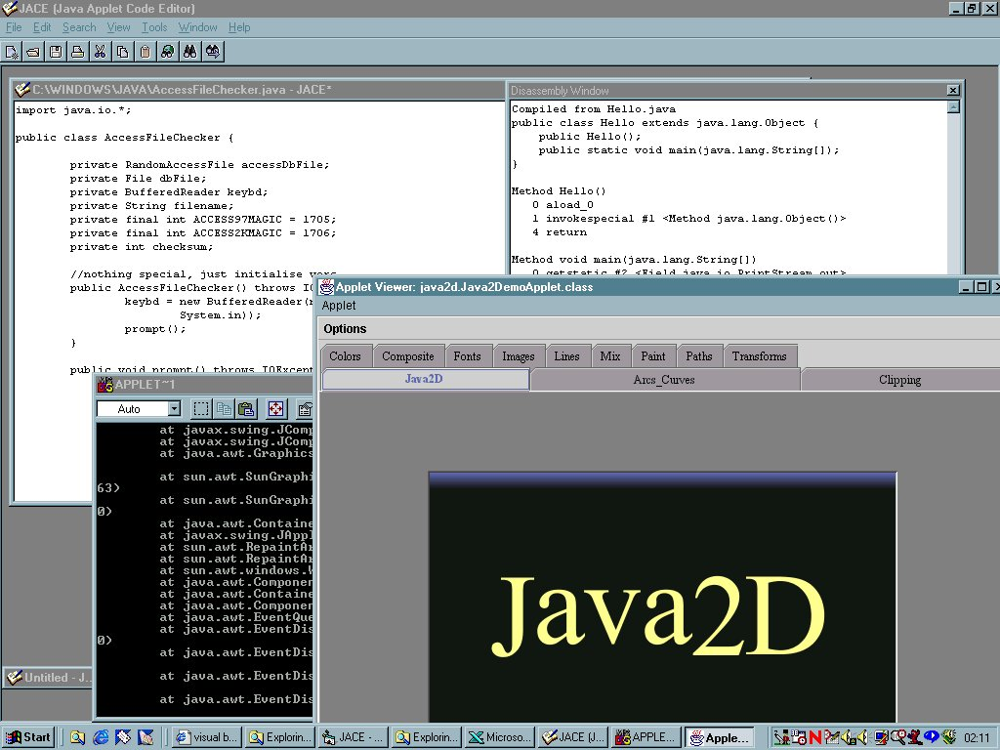



## Java Applet Code Editor \(JACE\)

### Description

JACE is an application that users can use to code their Java applications and applets. It has a MDI architecture. Also included is the option to disassemble Java classes using Sun JDK as well as browsing applets and documentation.

PLEASE NOTE, Sun JDK needs to be installed onto the target machine before using this program. This is because parts of the program call JDK and the batch files uses JDK.
 
### More Info
 
Place the two DOS batch files into the C:\ drive of your system.

Sun JDK needs to be installed onto the target machine.

If you are not using JDK1.4, please change the DOS batch files as well as VB code in the lines that refer to jdk1.4.

e.g. if VB code says c:\jdk1.4, then change yours to jdk1.3 if you have JDK1.3 installed. Check this for both VB code and the DOS batch files!

Various features of the program can be improved. These are:

Printing,

Closing child windows,

Disassembling classes,

Running applets

             |
---                |---
**Submitted On**   |2001-08-09 16:51:24
**By**             |[Rizzy J](https://github.com/Planet-Source-Code/PSCIndex/blob/master/ByAuthor/rizzy-j.md)
**Level**          |Intermediate
**User Rating**    |5.0 (15 globes from 3 users)
**Compatibility**  |VB 4\.0 \(32\-bit\), VB 5\.0, VB 6\.0
**Category**       |[Miscellaneous](https://github.com/Planet-Source-Code/PSCIndex/blob/master/ByCategory/miscellaneous__1-1.md)
**World**          |[Visual Basic](https://github.com/Planet-Source-Code/PSCIndex/blob/master/ByWorld/visual-basic.md)
**Archive File**   |[Java Apple24334892001\.zip](https://github.com/Planet-Source-Code/rizzy-j-java-applet-code-editor-jace__1-26018/archive/master.zip)

